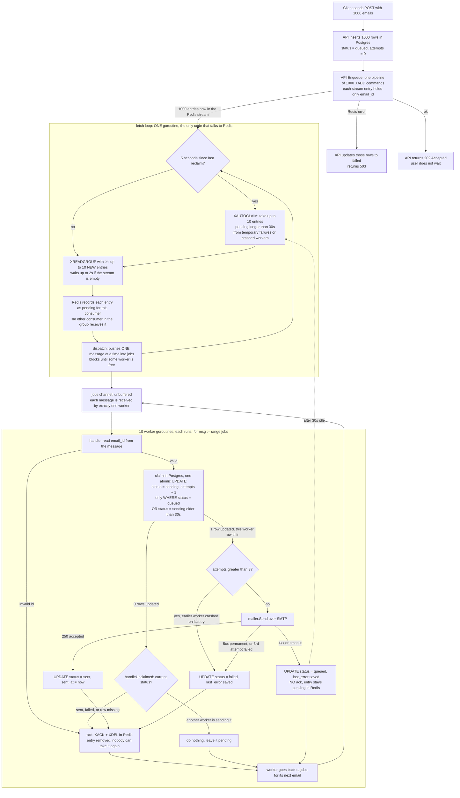

# Sendiz: Email Sending Flow

This document explains how Sendiz handles a batch of emails (for example, 1000) from the moment the `POST` request arrives until every email is sent or failed.

## Default settings

| Setting        | Default | Meaning                                        |
|----------------|---------|------------------------------------------------|
| `WORKER_COUNT` | 10      | Worker goroutines sending in parallel          |
| `MAX_ATTEMPTS` | 3       | Tries per email before giving up               |
| `RETRY_AFTER`  | 30s     | Wait before a failed or stuck email is retried |
| `SMTP_TIMEOUT` | 15s     | Longest a single SMTP send can take            |

## Flow diagram

## Step by step

1. **API (`cmd/main.go`)**: saves every email in Postgres as `queued`, pushes their IDs into the Redis stream in one pipeline, and returns `202` right away.
2. **Fetch loop (`worker.fetch`)**: the only code that talks to Redis.
   - Every 5 seconds, `XAUTOCLAIM` takes back entries that have been pending longer than `RETRY_AFTER`, so they can be retried.
   - On every loop, `XREADGROUP` reads up to `WORKER_COUNT` new entries.
   - `dispatch` hands them to the workers one at a time through the `jobs` channel.
3. **Workers (`worker.handle`)**: `WORKER_COUNT` goroutines, and each one holds exactly one email at a time.
   - **Claim**: one atomic `UPDATE` sets `status = sending` and `attempts + 1`.
   - **Send**: sends the email over SMTP.
   - **Update Postgres**: sets `sent`, `failed`, or back to `queued` for a retry.
   - **Ack in Redis**: runs `XACK` and `XDEL` only after the database update succeeds.

## SMTP result handling

| SMTP result                  | Postgres update                   | Redis                                 |
|------------------------------|-----------------------------------|---------------------------------------|
| 250 accepted                 | `status = sent`, `sent_at = now`  | Ack and delete                        |
| 5xx permanent error          | `status = failed`, `last_error`   | Ack and delete                        |
| 4xx or timeout               | `status = queued`, `last_error`   | Left pending, retried after 30s       |
| Fails on the final attempt   | `status = failed`                 | Ack and delete                        |

A 250 reply means the SMTP server accepted the email, not that it reached the recipient's inbox.

## Why no two workers send the same email

1. **Redis consumer group**: `XREADGROUP` with `">"` gives each entry to only one consumer.
2. **Unbuffered `jobs` channel**: each message is received by exactly one worker goroutine, and only when that worker is free.
3. **Atomic claim in Postgres**: `UPDATE ... WHERE status = 'queued'` can match for only one worker. Any other worker gets 0 rows and does not send.

## Delivery guarantee

Workers always update Postgres **before** acknowledging in Redis. If the database update fails, the entry is not acknowledged and gets redelivered, so an email's status is never lost. The trade-off is that, rarely, an email could be sent twice. This is called at-least-once delivery.

## Graceful shutdown

On shutdown, the fetch loop stops, the `jobs` channel is closed, and each worker finishes the email it is currently sending before exiting. Emails that were not picked up yet stay in the Redis stream until the worker starts again.