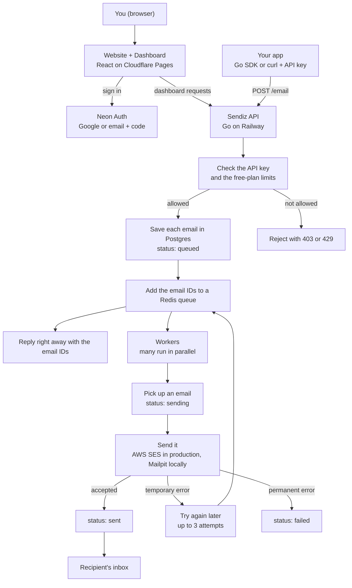

<p align="center">
  
</p>

<h1 align="center">Sendiz</h1>

<p align="center">
  <a href="https://sendiz.dev">sendiz.dev</a>
</p>

Sendiz is a minimal email-sending platform, built to scale. You send emails with one API call or the Go SDK. Sendiz saves them, queues them, and a pool of workers delivers them in the background, retrying when a mail server has a temporary problem. The dashboard lets you create API keys, send a test email, see every email's status, and track your daily usage.

## Project architecture



- **Postgres (Neon)** is the source of truth: every email, API key, and daily usage count lives there.
- **Redis** only holds email IDs, so the API can reply fast and workers can share the load.
- If a worker crashes mid-send, another worker picks the email up again after a short wait.
- Checking an email's status (`GET /email/:id`) reads it straight from Postgres.

## Project folder structure

```text
sendiz/
├── backend/                 Go API and workers
│   ├── cmd/main.go          Entry point: api, worker, serve (both), migrate
│   ├── internal/
│   │   ├── handlers/        HTTP routes: emails, dashboard, API keys, limits
│   │   ├── worker/          Reads the queue and sends emails with retries
│   │   ├── mailer/          Sending through SMTP (Mailpit) or the AWS SES API
│   │   ├── queue/           Redis queue
│   │   ├── database/        Postgres connection and SQL migrations
│   │   ├── middleware/      Login and API-key checks
│   │   ├── auth/ apikey/    Neon Auth tokens and API-key hashing
│   │   ├── model/           Database tables as Go structs
│   │   └── config/ logger/  Settings and logging
│   ├── Dockerfile
│   └── Makefile
├── frontend/                Website and dashboard (React, Vite, Tailwind, shadcn/ui)
│   ├── src/                 Pages, components, and hooks
│   └── functions/           Cloudflare Pages proxies to the API and Neon Auth
├── sdk/go/                  Go SDK: github.com/karthikponna/sendiz/sdk/go
└── testing/                 Scripts to send test emails (single, batch, production)
```

## What we offer

- **Simple API and Go SDK:** send one email or up to 100 at once, then check each one's status.
- **API keys:** create and revoke them from the dashboard.
- **Dashboard:** a get-started guide, a list of every email and its status, API keys, and daily usage.
- **Reliable delivery:** background workers, automatic retries, and safe recovery if a worker crashes.
- **Free plan for testing only:** right now every user can send **10 emails per day**, and only to their own login email. The limit resets every day at midnight UTC.

## Prerequisites

- [Go](https://go.dev/dl/) 1.27 or newer
- [Bun](https://bun.sh)
- [Docker](https://www.docker.com/) (runs Redis and Mailpit locally)
- `make`
- A [Neon](https://neon.tech) project with Postgres and Neon Auth enabled

## Run it locally

Locally, emails don't go out to real inboxes. They land in [Mailpit](https://mailpit.axllent.org), a local inbox at http://localhost:8025.

1. **Clone the repo**

   ```bash
   git clone https://github.com/karthikponna/sendiz.git
   cd sendiz
   ```

2. **Add your settings**

   ```bash
   cp backend/.env.example backend/.env
   cp frontend/.env.example frontend/.env
   ```

   In both files, set `NEON_AUTH_BASE_URL` (Neon Console > Auth > Configuration). In `backend/.env`, also set `DATABASE_URL`. To turn off the free-plan limits locally, add `DAILY_EMAIL_LIMIT=0` and `ONLY_SEND_TO_SELF=false` to `backend/.env`.

3. **Start Redis and Mailpit, then create the tables**

   ```bash
   cd backend
   make infra-up
   make migrate-up
   ```

4. **Start the API and workers** (http://localhost:8080)

   ```bash
   make run
   ```

5. **Start the website** in a second terminal (http://localhost:5173)

   ```bash
   cd backend
   make frontend
   ```

   Sign up, then create an API key on the **API keys** page.

6. **Send test emails** in a third terminal

   ```bash
   cd testing
   make single key=sdz_YOUR_KEY          # one email
   make batch key=sdz_YOUR_KEY n=50      # 50 emails at once
   ```

   Open http://localhost:8025 to see them in Mailpit.

Run `make help` in `backend/` or `testing/` to see every command.

<br />

<p align="center">
  Thank you for reading till the end, please give a star ⭐
</p>
